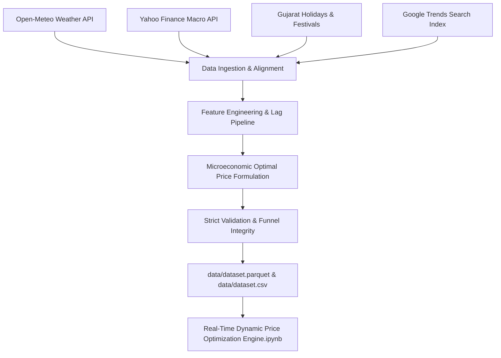

# Real-Time Dynamic Price Optimization Engine

A portfolio-grade, production-quality dataset and dynamic pricing intelligence pipeline engineered for Indian e-commerce marketplaces across Gujarat (Ahmedabad and Surat).



---

## 🚀 Key Highlights

- **148,000+ Observations**: Daily time series covering 130 SKUs across 8 retail categories in Ahmedabad and Surat from **January 2023 to August 2026**.
- **71 Rich Features**: Blending real-world API signals (temperature, rainfall, humidity, USD/INR, WTI crude oil proxy, gold prices, cultural festivals) with realistic e-commerce simulations (demand elasticity, competitor pricing, inventory stock-out risk).
- **Closed-Form Profit Maximization**: Target `Optimal_Price` computed via microeconomic constant-elasticity formula p* = c / (1 + 1/epsilon) with seasonal, festive, and competitive guardrails.
- **Zero-Leakage Guarantee**: Temporal lag and rolling features engineered strictly with chronological grouping and shifts (`shift(7)`, `rolling(30)`).
- **Leakage-Free Train/Val/Test Split**:
  - **Train**: Jan 1, 2023 – Jun 30, 2025 (~73%)
  - **Validation**: Jul 1, 2025 – Dec 31, 2025 (~16%)
  - **Test**: Jan 1, 2026 – Aug 2, 2026 (~11%)

---

## 📁 Repository Structure

```
Real-Time Dynamic Price Optimization Engine/
├── src/
│   ├── config.py                 # Central configurations, schemas, and elasticity seeds
│   ├── product_catalog.py        # 130 realistic SKUs across 9 launch cohorts
│   ├── api_fetcher.py            # Open-Meteo, yfinance, Gujarat festivals + SQLite cache
│   ├── feature_engineering.py    # Lag, rolling, impact scores, and momentum features
│   ├── optimal_price.py          # Vectorized microeconomic pricing engine
│   ├── batch_generator.py        # Memory-safe batch data synthesis and export
│   ├── validator.py              # Business rules, funnel integrity, and ML benchmarks
│   └── report_generator.py       # Metadata, dictionary, and quality report generator
├── generate_dataset.py           # Master CLI orchestrator
├── data/
│   ├── dataset.csv               # Complete dataset in CSV format
│   ├── dataset.parquet           # Compressed Parquet dataset (Snappy)
│   ├── metadata.json             # Provenance metadata & city coordinates
│   ├── validation_report.json    # Machine-readable validation metrics
│   ├── rejected_rows.csv         # Rejection log (0 violations)
│   └── data_quality_report.md    # Comprehensive data quality report
├── data_dictionary.md            # Detailed 71-column reference
├── Real-Time Dynamic Price Optimization Engine.ipynb # Model training & inference notebook
├── requirements.txt              # Environment dependencies
└── README.md
```

---

## 🛠️ Reproduction & Usage

```bash
# 1. Clone the repository and install requirements
pip install -r requirements.txt

# 2. Run the end-to-end dataset generation pipeline
python generate_dataset.py
```

---

## 📜 License
MIT License. Built for final-year engineering capstone & machine learning portfolio.
