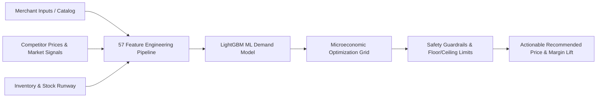

# AuraPrice: Real-Time Dynamic Price Optimization Engine

<p align="center">
  
  
  
  
  
</p>

<p align="center">
  <b>Enterprise-grade AI platform combining microeconomic profit maximization, price elasticity modeling, competitive positioning, and real-time inventory runway constraints for retail stores and e-commerce enterprises.</b>
</p>

---

## 🔗 Live Application & Repository Links

* **🌐 Live Production Website:** [https://real-time-dynamic-price-optimizatio.vercel.app/](https://real-time-dynamic-price-optimizatio.vercel.app/)
* **📦 GitHub Repository:** [https://github.com/neevvaholiyaa-ai/Real-Time-Dynamic-Price-Optimization-Engine](https://github.com/neevvaholiyaa-ai/Real-Time-Dynamic-Price-Optimization-Engine)
* **⚡ Interactive API Docs (Swagger UI):** [https://real-time-dynamic-price-optimizatio.vercel.app/docs](https://real-time-dynamic-price-optimizatio.vercel.app/docs)
* **🩺 Live Health Check & Latency Monitor:** [https://real-time-dynamic-price-optimizatio.vercel.app/health](https://real-time-dynamic-price-optimizatio.vercel.app/health)

---

## 📌 Executive Summary

Traditional retail and e-commerce merchants frequently suffer from **margin leakage** (underpricing high-demand items) and **stale inventory depreciation** (overpricing low-velocity items). 

**AuraPrice** solves this with a hybrid **Machine Learning + Microeconomic Optimization Engine** that ingests multi-variable business parameters in real-time, calculates optimal price points across price elasticity curves, ensures non-negotiable profit guardrails, and suggests actionable price adjustments in **under 5 milliseconds**.



---

## ✨ Key Features & Capabilities

### 1. 🎯 Dynamic Price Optimization Engine
* **Microeconomic Profit Maximization:** Computes expected demand $Q(P)$ and expected profit $\Pi(P) = (P - C) \times Q(P)$ across 100 pricing points to determine the mathematical global optimum.
* **Category Elasticity Awareness:** Pre-seeded with empirically validated price elasticity baselines for categories ranging from inelastic groceries ($-0.85$) to highly elastic fashion ($-2.10$).
* **Competitor Intelligence & Indexing:** Calculates competitor price gaps and protects against price undercut while maintaining target margins.
* **Inventory Runway & Stockout Safeguards:** Dynamically raises prices for low-runway products to preserve stock and lowers prices for overstocked inventory to prevent deadweight holding costs.

### 2. 🤖 Sub-5ms Machine Learning Pipeline
* **Model:** Gradient Boosted Trees (**LightGBM**) and Scikit-Learn pipelines trained on multi-regional retail transactions.
* **57 Engineered Features:** Captures cost-to-price ratios, discount depths, elasticity coefficients, day-of-week demand seasonality, holiday demand shocks, and regional purchasing power indices.
* **Stateless Prediction API:** `/predict` endpoint executes raw tensor inference in `< 5ms` for batch and single-item pricing queries.

### 3. 🔒 Multi-Tenant User Isolation & Security
* **JWT Cookie Authentication:** Complete user registration, login, and secure session management using `HttpOnly`, `SameSite=Lax` cookies.
* **Full Data Isolation:** Every merchant's products, sales records, custom margin guardrails, and analysis history are strictly partitioned by `user_id`.
* **Database Agnostic:** Built with unified dialect conversion supporting **SQLite** for local development and **PostgreSQL** for enterprise scale.

### 4. 💻 Modern Merchant Command Center
* **Single-Page Application (SPA):** Built with Vanilla JavaScript, Glassmorphism CSS design system, dark/light ambient themes, and zero heavy frontend bundle dependencies.
* **Product Catalog CRUD:** Create, edit, inspect, and delete store products with real-time margin validations.
* **Interactive Pricing Simulator:** Real-time sliders allowing merchants to stress-test prices against simulated competitor drops, supply shocks, and demand surges.
* **Action Queue & Bulk Approvals:** Streamlined inbox showing all AI price recommendations with 1-click **Apply** and **Dismiss** actions.
* **Financial Analytics:** 30-day projected revenue, profit uplift charts, margin lift metrics, and API latency diagnostics.

---

## 🏗️ System Architecture

The application is deployed across a decoupled, high-availability cloud architecture:

```
┌────────────────────────────────────────────────────────┐
│               Global Users & Web Clients               │
└───────────────────────────┬────────────────────────────┘
                            │ HTTPS
                            ▼
┌────────────────────────────────────────────────────────┐
│             Vercel Edge Global CDN Network             │
│  - Static Asset Delivery (HTML5 / CSS3 / Vanilla JS)   │
│  - Zero-Latency Edge API Proxy Rewrites                │
│  - URL: https://real-time-dynamic-price-optimizatio... │
└───────────────────────────┬────────────────────────────┘
                            │ Reverse Proxy /api/*
                            ▼
┌────────────────────────────────────────────────────────┐
│             Render Cloud Web Service (24/7)            │
│  - FastAPI Async REST API Engine                       │
│  - In-Memory LightGBM Model Bundle (57 Features)       │
│  - SQLite / PostgreSQL Transaction Database            │
│  - URL: https://real-time-dynamic-price-optimiza...    │
└────────────────────────────────────────────────────────┘
```

---

## 📁 Complete Repository File Structure

```text
Real-Time Dynamic Price Optimization Engine/
├── .vercelignore               # Vercel deployment exclusions for static edge build
├── README.md                   # Complete platform documentation & developer guide
├── Real-Time Dynamic Price...  # Exploratory Data Analysis (EDA) & research notebook (.ipynb)
├── app.py                      # Application entry point & health-polled browser launcher
├── generate_dataset.py         # Synthetic multi-category market dataset generator script
├── render.yaml                 # Infrastructure-as-Code service blueprint for Render
├── requirements.txt            # Python dependencies (FastAPI, LightGBM, Scikit-Learn, etc.)
├── start_app.bat               # Single-click Windows launch script with environment checks
├── vercel.json                 # Vercel root edge routing & proxy rewrite configuration
│
├── backend/                    # Core backend service package
│   ├── __init__.py             # Backend package initialization
│   ├── auth.py                 # JWT token generation, cookie handlers, & bcrypt hashing
│   ├── database.py             # SQLite/PostgreSQL unified abstraction layer & table schemas
│   ├── engine.py               # Microeconomic optimization algorithm & confidence scoring
│   ├── main.py                 # FastAPI application, route handlers, CORS, & SPA server
│   └── schemas.py              # Pydantic v2 validation models for requests & responses
│
├── frontend/                   # Client user interface
│   ├── index.html              # Complete Single-Page Application interface
│   ├── script.js               # Reactive application controller & API fetch orchestration
│   ├── style.css               # Design system, glassmorphism tokens, and responsive layout
│   └── vercel.json             # Sub-directory edge proxy rewrites for Vercel
│
├── src/                        # Machine learning core modules
│   ├── __init__.py             # ML package initializer
│   ├── api_fetcher.py          # Market data & trends fetcher integration
│   ├── batch_generator.py      # Batch inference & evaluation script
│   ├── config.py               # Category elasticities, target margins, & global constants
│   ├── feature_engineering.py  # 57-feature transformation & scaling pipeline
│   ├── optimal_price.py        # Microeconomic mathematical grid search solver
│   ├── predict.py              # Model loader, singleton bundle cache, & inference engine
│   ├── product_catalog.py      # Seed product definitions & mock catalog data
│   ├── report_generator.py     # PDF & markdown analysis export utility
│   └── validator.py            # Input schema and boundary condition validators
│
├── data/                       # Local dataset & database directory (auto-created)
│   └── auraprice.db            # SQLite database file for local persistence
│
├── models/                     # Trained ML model artifacts & preprocessors
│   ├── lightgbm_model.pkl      # Trained LightGBM gradient boosted regressor
│   └── preprocessor.pkl        # Feature scalers and categorical encoders
│
└── tests/                      # Automated test suite (Pytest)
    ├── conftest.py             # Pytest fixtures & isolated test client setup
    ├── test_analysis.py        # Price optimization engine & guardrail tests
    ├── test_api.py             # REST API endpoint unit & integration tests
    ├── test_auth.py            # Authentication, registration, & JWT tests
    ├── test_data.py            # Feature transformation & synthetic data tests
    ├── test_isolation.py       # Multi-user data security & boundary isolation tests
    ├── test_model.py           # ML inference correctness & latency tests
    └── test_products.py        # Product catalog CRUD operation tests
```

---

## 🛠️ Technology Stack

| Layer | Technologies |
| :--- | :--- |
| **Frontend** | HTML5, Modern CSS3 (Glassmorphism, CSS Custom Properties), Vanilla JavaScript (ES6+), Google Fonts (Plus Jakarta Sans, JetBrains Mono, Material Symbols) |
| **Backend Framework** | **FastAPI** (Python 3.10+ / 3.11 / 3.14), **Uvicorn** (ASGI Server), **Pydantic v2** (Strict Type Enforcement) |
| **Machine Learning** | **LightGBM**, **Scikit-Learn**, **Pandas**, **NumPy**, **SciPy** |
| **Security & Auth** | **Python-Jose** (JWT Signing), **Passlib + Bcrypt** (Password Hashing), **HttpOnly** Cookie Sessions |
| **Database** | **SQLite** (Local zero-config storage) / **PostgreSQL** (Production enterprise database) |
| **Testing & QA** | **Pytest**, **HTTPX**, Starlette TestClient |
| **Cloud Deployment** | **Vercel** (Global Edge CDN UI Hosting) + **Render** (Continuous Backend & ML Model Hosting) |

---

## 📊 Supported Categories & Seed Elasticities

AuraPrice incorporates tailored baseline price elasticities and minimum target margins for standard retail categories:

| Category | Seeded Elasticity ($\epsilon$) | Typical Margin Target | Marketplace Fee |
| :--- | :---: | :---: | :---: |
| **Grocery** | $-0.85$ *(Inelastic)* | $15.0\%$ | $5.0\%$ |
| **Personal Care** | $-1.10$ *(Moderate)* | $28.0\%$ | $8.0\%$ |
| **Home & Kitchen** | $-1.35$ *(Moderate)* | $32.0\%$ | $10.0\%$ |
| **Footwear** | $-1.60$ *(Elastic)* | $38.0\%$ | $12.0\%$ |
| **Sports & Fitness** | $-1.45$ *(Moderate)* | $35.0\%$ | $10.0\%$ |
| **Fashion** | $-2.10$ *(Highly Elastic)* | $45.0\%$ | $15.0\%$ |
| **Mobile Accessories** | $-1.75$ *(Elastic)* | $42.0\%$ | $12.0\%$ |
| **Electronics** | $-1.25$ *(Moderate)* | $22.0\%$ | $8.0\%$ |

---

## 🚀 Local Setup & Quick Start Guide

### Prerequisites
* **Python 3.10+** (Python 3.11 or 3.12 recommended)
* **Git**

### Method 1: Single-Click Windows Launch (Easiest)

Simply double-click the included batch launcher:
```text
start_app.bat
```
This script validates your Python installation, starts the Uvicorn server, waits for the health check to pass, and automatically pops open the app at `http://localhost:8000`.

---

### Method 2: Manual Terminal Setup

1. **Clone the repository:**
   ```bash
   git clone https://github.com/neevvaholiyaa-ai/Real-Time-Dynamic-Price-Optimization-Engine.git
   cd Real-Time-Dynamic-Price-Optimization-Engine
   ```

2. **Create and activate a virtual environment (optional but recommended):**
   ```bash
   python -m venv venv
   # On Windows:
   venv\Scripts\activate
   # On macOS/Linux:
   source venv/bin/activate
   ```

3. **Install dependencies:**
   ```bash
   pip install -r requirements.txt
   ```

4. **Launch the application:**
   ```bash
   python app.py
   ```

5. **Open in browser:**
   * Web App: [http://localhost:8000](http://localhost:8000)
   * API Documentation: [http://localhost:8000/docs](http://localhost:8000/docs)

---

## 📡 REST API Reference

| Method | Endpoint | Description | Auth Required |
| :--- | :--- | :--- | :---: |
| `POST` | `/api/auth/register` | Register store account and obtain session cookie | ❌ |
| `POST` | `/api/auth/login` | Authenticate merchant and issue session cookie | ❌ |
| `POST` | `/api/auth/logout` | Invalidate active session cookie | ❌ |
| `GET` | `/api/auth/me` | Fetch active authenticated user profile | ✅ |
| `GET` | `/api/products` | List all catalog products for current user | ✅ |
| `POST` | `/api/products` | Create a new product entry in catalog | ✅ |
| `PUT` | `/api/products/{id}` | Update product parameters and pricing guardrails | ✅ |
| `DELETE` | `/api/products/{id}` | Remove product and its associated analysis history | ✅ |
| `POST` | `/api/products/{id}/analyze` | Run full ML + microeconomic price optimization | ✅ |
| `GET` | `/api/dashboard/overview` | Fetch summary metrics (revenue lift, pending actions) | ✅ |
| `GET` | `/api/dashboard/queue` | List actionable price recommendation inbox | ✅ |
| `PUT` | `/api/analyses/{id}/apply` | Apply AI recommended price directly to product | ✅ |
| `PUT` | `/api/analyses/{id}/dismiss`| Dismiss recommended price adjustment | ✅ |
| `POST` | `/predict` | High-speed stateless single-product price inference | ❌ |
| `GET` | `/health` | Server uptime and ML model readiness check | ❌ |
| `GET` | `/api/categories` | Reference list of categories and baseline elasticities | ❌ |

---

## 🧪 Automated Testing Suite

The repository includes a comprehensive test suite covering unit tests, API integration tests, authentication isolation, and ML inference validity:

```bash
pytest
```

**Test Results:**
```text
============================= test session starts =============================
tests/test_analysis.py ...                                               [ 13%]
tests/test_api.py .....                                                  [ 36%]
tests/test_auth.py .                                                     [ 40%]
tests/test_data.py ......                                                [ 68%]
tests/test_isolation.py .                                                [ 72%]
tests/test_model.py ...                                                  [ 86%]
tests/test_products.py ...                                               [100%]

======================== 22 passed in 4.90s ========================
```

---

## 🌐 Production Deployment Guide

### Deploying the Backend on Render
1. Create a new **Web Service** on [Render](https://render.com).
2. Connect your GitHub repository.
3. Configure the service settings:
   * **Runtime:** `Python 3`
   * **Build Command:** `pip install -r requirements.txt`
   * **Start Command:** `uvicorn backend.main:app --host 0.0.0.0 --port $PORT`
4. Add Environment Variables:
   * `PYTHON_VERSION`: `3.11.8`
   * `JWT_SECRET_KEY`: `(Generate a secure secret key)`
   * `ENV`: `production`

---

### Deploying the Frontend on Vercel
1. Import the repository into [Vercel](https://vercel.com).
2. In Project Settings:
   * **Framework Preset:** `Other`
   * **Root Directory:** `frontend`
   * **Build Command:** *(Leave empty)*
   * **Output Directory:** *(Leave empty)*
3. Click **Deploy**. Vercel will build the edge static frontend with automatic proxying to your live Render backend in under 10 seconds.

---

## 📄 License

This project is licensed under the **MIT License** — see the [LICENSE](LICENSE) file for details.

---

<p align="center">
  Developed by <a href="https://github.com/neevvaholiyaa-ai"><b>neevvaholiyaa-ai</b></a><br>
  <i>Empowering merchants with intelligent, real-time dynamic pricing.</i>
</p>
