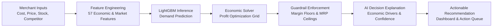
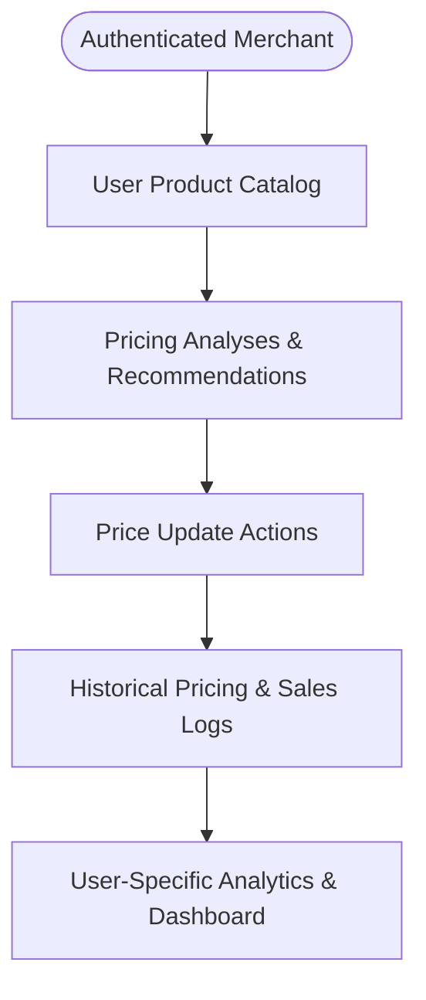
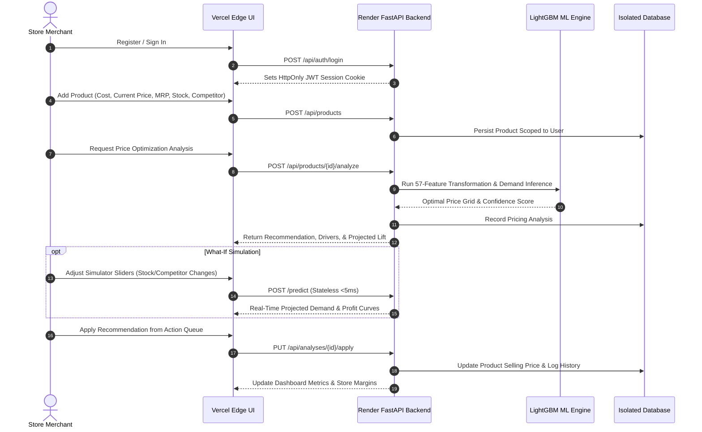

# AuraPrice

**AI-Powered Dynamic Pricing Intelligence & Margin Optimization for Real-World Retail**

AuraPrice is an enterprise-grade pricing intelligence platform designed to help retail businesses and e-commerce merchants replace static pricing guesswork with data-driven, margin-protected pricing recommendations.

---

### 🌐 Live Application
* **Live Web Application:** [https://real-time-dynamic-price-optimizatio.vercel.app/](https://real-time-dynamic-price-optimizatio.vercel.app/)
* **Source Repository:** [https://github.com/neevvaholiyaa-ai/Real-Time-Dynamic-Price-Optimization-Engine](https://github.com/neevvaholiyaa-ai/Real-Time-Dynamic-Price-Optimization-Engine)

> *To access the live platform, create a store account directly on the login screen.*

---

## 📌 Project Overview

Pricing decisions directly dictate merchant survival, yet traditional retail pricing relies heavily on static markups or manual intuition. Merchants often struggle to balance multiple conflicting variables simultaneously: wholesale acquisition costs, maximum retail price (MRP) ceilings, competitor price movements, stock levels, inventory holding costs, and price elasticity of demand.

**AuraPrice** integrates these variables into a unified, user-first workflow. The platform analyzes merchant-supplied product parameters, evaluates price-demand relationships using a trained LightGBM machine learning model and microeconomic profit curves, enforces strict margin guardrails, and provides transparent, actionable pricing recommendations with transparent rationale.

---

## 🎯 Problem AuraPrice Solves

Traditional retail store owners and pricing managers often manage pricing across spreadsheets or static rules, leading to two common failure modes:
1. **Margin Leakage:** Selling high-demand or low-supply products below optimal market willingness-to-pay.
2. **Deadweight Inventory Depreciation:** Holding overpriced stock too long, leading to tied-up working capital and distress markdowns.

AuraPrice answers the critical operational questions for every product in a merchant's catalog:
* *What price should I set today based on current stock, costs, and market conditions?*
* *Why is this price recommended, and what are the primary economic drivers behind it?*
* *How will a price change impact projected sales volume, revenue, and gross profit?*
* *How do I ensure recommendations never violate my minimum margin or MRP limits?*

---

## ⚙️ How AuraPrice Works

AuraPrice combines machine learning demand inference with deterministic microeconomic optimization and strict rule-based guardrails:



1. **Input Ingestion:** The merchant enters core business parameters (cost price, current price, MRP, stock quantity, average daily sales, and competitor pricing).
2. **Feature Transformation:** A 57-dimensional feature vector is generated capturing cost-to-price ratios, discount depths, elasticity baselines, and stock velocity.
3. **Machine Learning Inference:** The LightGBM demand model predicts sales velocity across varying price intervals.
4. **Profit Optimization:** An economic solver evaluates expected revenue and profit across a discretized price grid to locate the global profit-maximizing price.
5. **Guardrail Enforcement:** User-defined and category constraints (minimum gross margin %, absolute price floors, MRP ceilings, and maximum percentage shift limits) are enforced.
6. **Transparent Explanation:** The engine outputs the recommended price along with confidence scores, economic drivers, and expected profit impact.

---

## 🌟 Core Features

### 🛍️ Custom Product Catalog Management
* Merchants create, manage, and analyze their own product catalog.
* Supports multi-category catalog structures with category-specific price elasticity baselines.

### 📈 Dynamic Pricing Analysis
* Evaluates individual products on-demand using all available business and market signals.
* Produces clear recommendations: **Increase Price**, **Decrease Price**, or **Maintain Price**.

### 🧪 Interactive "What-If" Price-Profit Simulator
* Real-time interactive simulation sliders allow merchants to explore hypothetical market conditions (e.g., competitor price drops, stock supply surges).
* Visualizes projected demand curves, expected 30-day revenue, and gross profit in real time without altering live catalog data.

### 🧠 Transparent Decision Rationale
* Explains the mathematical and economic rationale behind every recommendation.
* Surfaces key economic drivers (e.g., *High Stock Runway*, *Favorable Competitor Gap*, *High Elasticity Demand Shock*).
* Categorizes recommendation confidence (*High*, *Medium*, *Low*) based on the completeness of merchant-supplied business inputs.

### 🛡️ Non-Negotiable Margin Guardrails
* **Margin Floor Protection:** Guarantees prices never breach the merchant's target or minimum gross margin.
* **MRP Ceiling:** Ensures prices never exceed legal Maximum Retail Price boundaries.
* **Price Volatility Dampening:** Prevents drastic price swings by applying configurable percentage bounds per optimization cycle.

### 📬 Reprice Action Queue
* Centralized operational inbox displaying pending pricing recommendations across the catalog.
* Enables 1-click price application or dismissal, updating live catalog prices immediately.

### 📊 Revenue & Margin Intelligence
* Consolidates store-wide pricing health, average profit margins, projected revenue lift, and inventory runway metrics into an executive dashboard.

---

## 🏛️ User-Centric Architecture & Data Principles

A core architectural principle of AuraPrice is that **user-generated business data is the sole source of truth**:



* **Complete Tenant Isolation:** Every user's catalog, sales logs, analyses, and custom settings are strictly isolated and query-scoped by authenticated user ID.
* **No Fabricated Business Data:** AuraPrice never generates synthetic inventory or sales data for a merchant's store. If a business input is not provided, the engine clearly flags it as a model estimate.
* **Separation of Actual vs. Projected Metrics:** 
  * **Actual Metrics:** Computed strictly from historical sales records recorded by the user.
  * **Projected Metrics:** Labeled as model-estimated simulations derived from demand elasticity curves.

---

## 🔬 Pricing Intelligence Engine

The pricing intelligence engine operates as a hybrid pipeline combining machine learning inference with microeconomic optimization:

```
┌─────────────────────────────────────────────────────────────┐
│                    Merchant Business Inputs                 │
│         Cost Price • Current Price • MRP • Stock • Comp     │
└──────────────────────────────┬──────────────────────────────┘
                               │
                               ▼
┌─────────────────────────────────────────────────────────────┐
│             57-Dimensional Feature Transformer              │
│       Elasticity Baselines • Margin Ratios • Seasonality    │
└──────────────────────────────┬──────────────────────────────┘
                               │
                               ▼
┌─────────────────────────────────────────────────────────────┐
│              LightGBM Gradient Boosted Regressor            │
│            Predicts Expected Demand Curve Q(Price)          │
└──────────────────────────────┬──────────────────────────────┘
                               │
                               ▼
┌─────────────────────────────────────────────────────────────┐
│                 Microeconomic Profit Solver                 │
│      Maximizes Profit:  Π(P) = (P - Cost) × Expected_Q(P)   │
└──────────────────────────────┬──────────────────────────────┘
                               │
                               ▼
┌─────────────────────────────────────────────────────────────┐
│                 Guardrail & Safety Validation               │
│       Min Margin % • MRP Ceiling • Max Allowed Price Δ%     │
└──────────────────────────────┬──────────────────────────────┘
                               │
                               ▼
┌─────────────────────────────────────────────────────────────┐
│            Final Output & Actionable Intelligence           │
│    Recommended Price • Margin Lift % • Economic Rationale   │
└─────────────────────────────────────────────────────────────┘
```

---

## 💻 Technology Stack

AuraPrice is built using a clean, modern, and dependency-conscious technology stack:

| Component | Technologies | Description |
| :--- | :--- | :--- |
| **Frontend UI** | **HTML5, Vanilla CSS3, Vanilla JavaScript (ES6+)** | Lightweight, high-performance Single-Page Application (SPA) with a custom Glassmorphic design system and zero heavy frontend bundle dependencies. |
| **Backend API** | **Python, FastAPI, Uvicorn, Pydantic v2** | High-concurrency asynchronous REST API framework enforcing strict schema validation and sub-5ms response times. |
| **Machine Learning** | **LightGBM, Scikit-Learn, Pandas, NumPy, SciPy** | Gradient-boosted decision tree regressor for demand forecasting, paired with microeconomic optimization algorithms. |
| **Database & Storage** | **SQLite (Development) / PostgreSQL (Production)** | Unified database abstraction layer with automatic parameter dialect conversion and schema initialization. |
| **Authentication** | **JWT (JSON Web Tokens), Bcrypt, HttpOnly Cookies** | Secure cookie-based session management with encrypted password hashing and cross-origin security headers. |
| **Cloud Deployment** | **Vercel (Edge Frontend) + Render (Cloud Backend)** | Decoupled cloud architecture pairing global edge CDN static delivery with an always-on Python ML inference service. |

---

## 📁 Repository Structure

```text
Real-Time Dynamic Price Optimization Engine/
├── backend/                    # Core backend service package
│   ├── auth.py                 # JWT token management, cookie sessions, & password hashing
│   ├── database.py             # SQLite/PostgreSQL unified database abstraction layer
│   ├── engine.py               # Microeconomic optimization algorithm & confidence scoring
│   ├── main.py                 # FastAPI application, route handlers, CORS, & SPA server
│   └── schemas.py              # Pydantic v2 validation models for requests and responses
│
├── frontend/                   # Client Single-Page Application
│   ├── index.html              # Responsive merchant dashboard & command center UI
│   ├── script.js               # Reactive client controller & API integration
│   ├── style.css               # Design system, glassmorphism tokens, and responsive layout
│   └── vercel.json             # Vercel sub-directory edge proxy configuration
│
├── src/                        # Machine learning & economic modeling modules
│   ├── config.py               # Category elasticities, target margins, & system constants
│   ├── feature_engineering.py  # 57-feature transformation pipeline
│   ├── optimal_price.py        # Microeconomic mathematical grid search solver
│   ├── predict.py              # Model bundle loader, singleton cache, & inference engine
│   └── validator.py            # Business logic and boundary condition validators
│
├── models/                     # Trained Machine Learning artifacts
│   ├── lightgbm_model.pkl      # Trained LightGBM demand regression model
│   └── preprocessor.pkl        # Feature scalers and categorical encoders
│
├── tests/                      # Automated test suite (Pytest)
│   ├── test_analysis.py        # Pricing optimization and guardrail rule tests
│   ├── test_api.py             # REST API endpoint unit & integration tests
│   ├── test_auth.py            # Authentication, registration, and session tests
│   ├── test_isolation.py       # Multi-tenant data security & user isolation tests
│   └── test_model.py           # ML inference correctness & latency tests
│
├── app.py                      # Application entry point & health-polled launcher
├── render.yaml                 # Infrastructure-as-Code service blueprint for Render
├── vercel.json                 # Vercel root edge routing & proxy rewrite configuration
├── .vercelignore               # Cloud deployment build exclusions
└── requirements.txt            # Python dependencies (FastAPI, LightGBM, Scikit-Learn, etc.)
```

---

## 🔄 End-to-End User Workflow



---

## ☁️ Production Deployment Architecture

AuraPrice is deployed using a decoupled, production-grade cloud topology:

* **Frontend Layer (Vercel Edge Network):**
  The static Single-Page Application assets (`index.html`, `style.css`, `script.js`) are served globally via Vercel's Edge CDN. API requests (`/api/*`, `/health`, `/predict`, `/docs`) are seamlessly reverse-proxied at the edge directly to the backend service.
* **Backend & ML Layer (Render Cloud Web Service):**
  The FastAPI ASGI server and in-memory LightGBM machine learning bundle run continuously on Render with automated health monitoring.
* **Persistence Layer:**
  Data is securely managed and persisted with multi-user isolation and foreign-key integrity constraints.

---

## 🎨 Visual & Responsive Design

AuraPrice features a custom-crafted, business-focused user interface:
* **Glassmorphic Aesthetic:** Deep slate backdrops (`#0F172A`), translucent card containers, subtle border glows, and curated color palettes (emerald profit lifts, coral warnings, and indigo brand accents).
* **Fully Responsive:** Fluid layouts designed for mobile inventory checks, tablet management, laptop screens, and ultra-wide desktop command centers.
* **Accessible Typography:** Structured hierarchy using *Plus Jakarta Sans* for readable business data and *JetBrains Mono* for currency and numerical metrics.

---

## 🎯 Project Goals

AuraPrice was developed to demonstrate:
1. **Practical AI Application:** Bridging theoretical machine learning with microeconomic profit equations to solve tangible retail challenges.
2. **Transparent Decision Support:** Avoiding "black-box" predictions by delivering human-understandable economic drivers and confidence scoring.
3. **Enterprise Architecture:** Building a clean, secure, multi-tenant system with strict user isolation, zero synthetic business data claims, and sub-5ms API performance.

---

## 📄 License

This project is licensed under the **MIT License** — see the [LICENSE](LICENSE) file for details.

<p align="center">
  Developed by <a href="https://github.com/neevvaholiyaa-ai"><b>neevvaholiyaa-ai</b></a>
</p>
